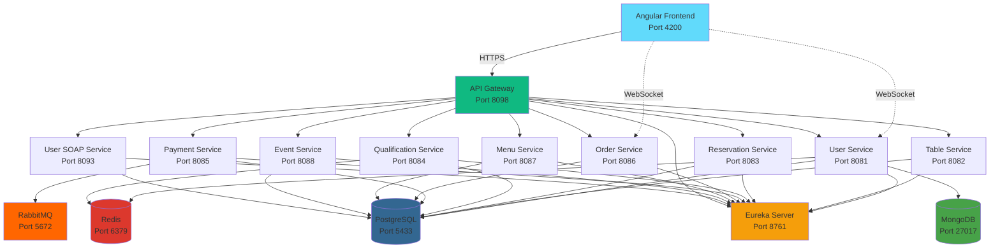
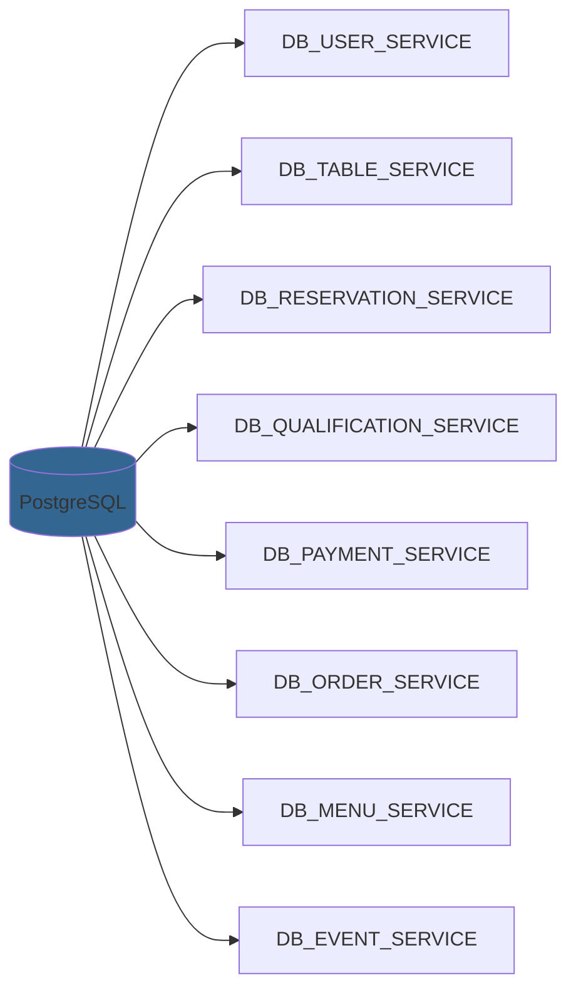
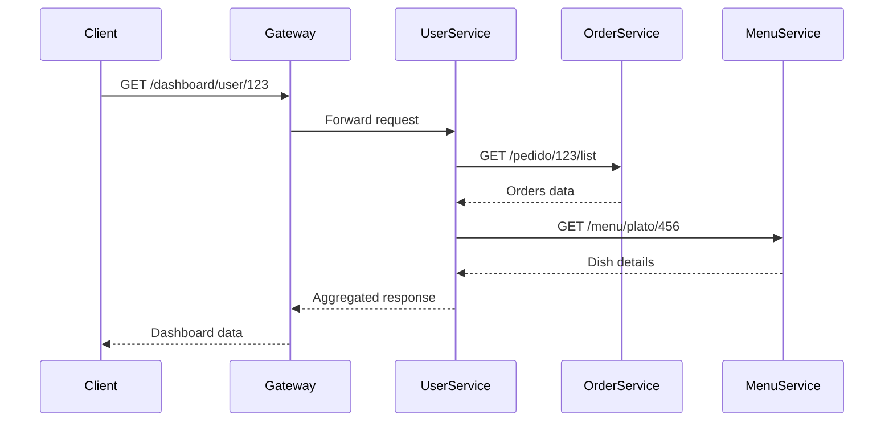
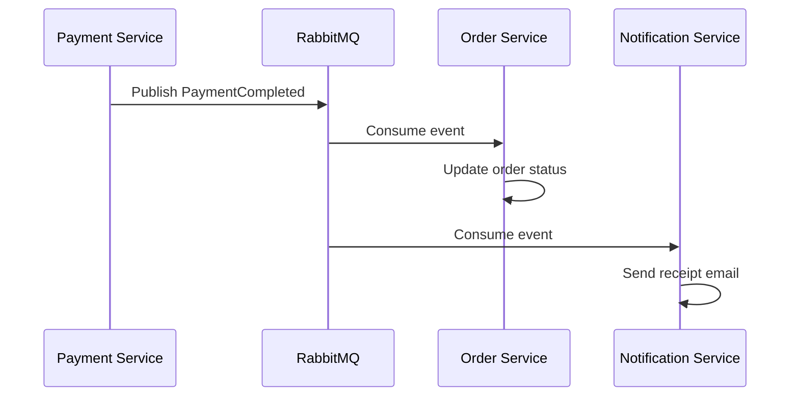
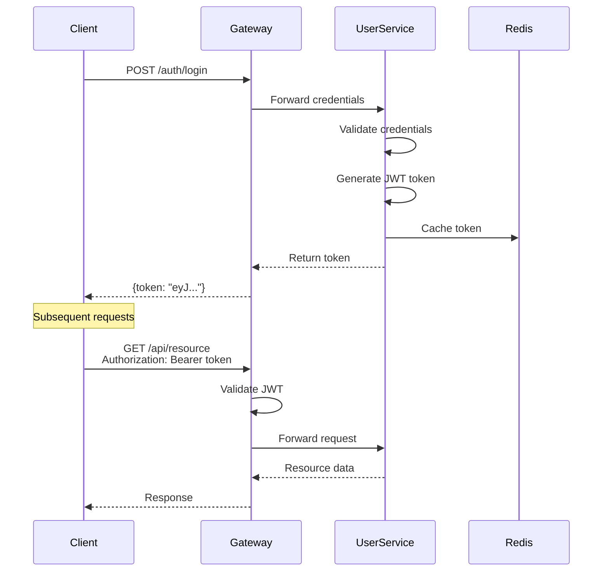
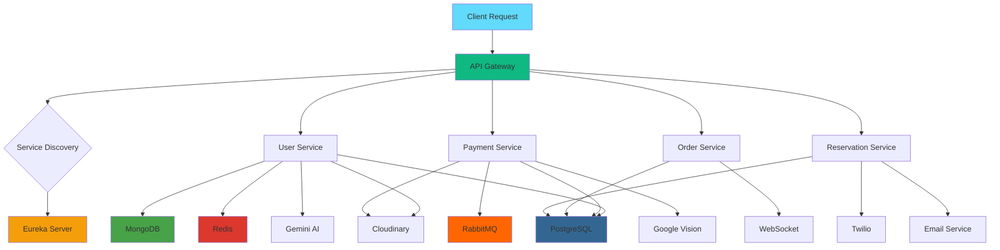

## Architecture Overview

KoroFood is built on a **microservices architecture** where each service is independent, making the system resilient to change and highly scalable. The architecture follows modern cloud-native principles with service discovery, API gateway patterns, and event-driven communication.



## Core Components

### API Gateway (Port 8098)

The **single entry point** for all client requests. The API Gateway handles:

- **Request Routing**: Forwards requests to appropriate microservices
- **Load Balancing**: Distributes traffic across service instances
- **Authentication**: Validates JWT tokens before routing
- **Cross-Cutting Concerns**: Logging, monitoring, rate limiting

<CodeGroup>

```yaml Docker Configuration
api-gateway:
  build: ./apiGateway
  ports:
    - "8098:8098"
  depends_on:
    eureka-server:
      condition: service_healthy
  environment:
    EUREKA_CLIENT_SERVICEURL_DEFAULTZONE: http://eureka-server:8761/eureka/
    EUREKA_INSTANCE_PREFER_IP_ADDRESS: "true"
    JWT_SECRET: ${JWT_SECRET}
```

```java Gateway Example Usage
// All API calls go through the gateway
GET  http://localhost:8098/auth/login
POST http://localhost:8098/reserva/registro
GET  http://localhost:8098/pedido
GET  http://localhost:8098/menu/pdf
```

</CodeGroup>

<Note>
  Never call microservices directly in production. Always route through the API Gateway for security and monitoring.
</Note>

### Service Discovery with Eureka (Port 8761)

Eureka Server provides **service registry and discovery**, allowing microservices to find and communicate with each other dynamically.

**Key Features:**
- Automatic service registration
- Health monitoring and heartbeat checks
- Dynamic load balancing
- Fault tolerance and failover

```yaml
eureka-server:
  build: ./eurekaService
  ports:
    - "8761:8761"
  healthcheck:
    test: ["CMD-SHELL", "wget -qO- http://localhost:8761/actuator/health || exit 1"]
    interval: 15s
    timeout: 10s
    retries: 10
    start_period: 60s
```

Access the Eureka Dashboard at **http://localhost:8761** to see all registered services.

## Microservices

### User Service (Port 8081)

**Primary service** that orchestrates other services and handles user management.

<Card title="Responsibilities" icon="user">
  - User authentication and authorization (JWT + OAuth 2.0)
  - Social login (Google, GitHub)
  - User profile management
  - AI-powered chatbot (Gemini API)
  - Real-time chat with WebSockets
  - Dashboard analytics aggregation
  - Image management (Cloudinary)
</Card>

**Databases Used:**
- **PostgreSQL**: User data, roles, districts (`DB_USER_SERVICE`)
- **MongoDB**: Chat messages and logs (`DB_MENSAJES`)
- **Redis**: Session caching, token storage

<CodeGroup>

```yaml Docker Configuration
user-service:
  build: ./userService/userService
  ports:
    - "8081:8081"
  depends_on:
    - postgres
    - mongodb
    - redis
    - eureka-server
  environment:
    SPRING_DATASOURCE_URL: jdbc:postgresql://postgres:5432/DB_USER_SERVICE
    SPRING_DATA_MONGODB_URI: mongodb://mongodb:27017/DB_MENSAJES
    SPRING_DATA_REDIS_HOST: redis
    SPRING_DATA_REDIS_PORT: 6379
    CLOUDINARY_NAME: ${CLOUDINARY_NAME}
    GEMINI_API_KEY: ${GEMINI_API_KEY}
```

```java Authentication Endpoint
@PostMapping("/auth/login")
public ResponseEntity<?> loginUsuario(@RequestBody LoginRequest loginRequest) {
    Authentication auth = authenticationManager.authenticate(
        new UsernamePasswordAuthenticationToken(
            loginRequest.getCorreo(),
            loginRequest.getClave()
        )
    );
    
    UserDetails userDetails = (UserDetails) auth.getPrincipal();
    List<String> roles = userDetails.getAuthorities()
        .stream()
        .map(GrantedAuthority::getAuthority)
        .collect(Collectors.toList());
    
    String token = jwtUtil.generateToken(loginRequest.getCorreo(), roles);
    return ResponseEntity.ok(Map.of("token", token));
}
```

</CodeGroup>

### Table Service (Port 8082)

<Card title="Responsibilities" icon="table">
  - Table management and availability
  - Seating capacity tracking
  - Table status updates
  - Zone/area management
</Card>

**Database:** PostgreSQL (`DB_TABLE_SERVICE`)

### Reservation Service (Port 8083)

<Card title="Responsibilities" icon="calendar-check">
  - Digital reservation system
  - Availability slot management
  - QR code generation for reservations
  - Email and SMS notifications (Twilio)
  - Event reservations
  - Cancellation handling
</Card>

**Database:** PostgreSQL (`DB_RESERVATION_SERVICE`)

<CodeGroup>

```yaml Environment Variables
environment:
  SPRING_DATASOURCE_URL: jdbc:postgresql://postgres:5432/DB_RESERVATION_SERVICE
  EMAIL_USERNAME: ${EMAIL_USERNAME}
  EMAIL_PASSWORD: ${EMAIL_PASSWORD}
  TWILIO_ACCOUNT_SID: ${TWILIO_ACCOUNT_SID}
  TWILIO_AUTH_TOKEN: ${TWILIO_AUTH_TOKEN}
  TWILIO_PHONE_NUMBER: ${TWILIO_PHONE_NUMBER}
```

```java Check Availability
@GetMapping("/slots-disponibles")
public ResultadoResponse<List<LocalDateTime>> obtenerSlotsDisponibles(
    @RequestParam Integer mesaId,
    @RequestParam LocalDateTime desde,
    @RequestParam LocalDateTime hasta,
    @RequestParam(required = false) Integer eventoId
) {
    List<LocalDateTime> slots = reservaService
        .obtenerSlotsDisponibles(mesaId, desde, hasta, eventoId);
    
    return ResultadoResponse.success("Slots disponibles obtenidos", slots);
}
```

</CodeGroup>

### Order Service (Port 8086)

<Card title="Responsibilities" icon="receipt">
  - Real-time order management
  - Waiter-customer communication via WebSocket
  - Order tracking and status updates
  - Kitchen integration
  - Sales reports and analytics
</Card>

**Database:** PostgreSQL (`DB_ORDER_SERVICE`)

**Communication:** WebSocket for real-time updates

<CodeGroup>

```java Create Order
@PostMapping
public ResponseEntity<ResultadoResponse<Pedido>> crearPedido(
    @RequestBody PedidoRequestDTO dto
) {
    ResultadoResponse<Pedido> resultado = pedidoService.crearPedido(dto);
    if (resultado.isValor()) {
        return ResponseEntity.status(HttpStatus.CREATED).body(resultado);
    }
    return ResponseEntity.status(HttpStatus.BAD_REQUEST).body(resultado);
}
```

```java WebSocket Configuration
@Configuration
@EnableWebSocketMessageBroker
public class WebSocketConfig implements WebSocketMessageBrokerConfigurer {
    
    @Override
    public void configureMessageBroker(MessageBrokerRegistry config) {
        config.enableSimpleBroker("/topic");
        config.setApplicationDestinationPrefixes("/app");
    }
    
    @Override
    public void registerStompEndpoints(StompEndpointRegistry registry) {
        registry.addEndpoint("/ws-order")
                .setAllowedOrigins("*")
                .withSockJS();
    }
}
```

</CodeGroup>

### Payment Service (Port 8085)

<Card title="Responsibilities" icon="credit-card">
  - Payment processing
  - Payment receipt generation (Google Vision API)
  - Transaction history
  - Payment method validation
  - Asynchronous payment notifications via RabbitMQ
</Card>

**Database:** PostgreSQL (`DB_PAYMENT_SERVICE`)  
**Message Queue:** RabbitMQ for event-driven notifications

```yaml
payment-service:
  environment:
    SPRING_RABBITMQ_HOST: rabbitmq
    SPRING_RABBITMQ_PORT: 5672
    SPRING_RABBITMQ_USERNAME: guest
    SPRING_RABBITMQ_PASSWORD: guest
    CLOUDINARY_CLOUD_NAME: ${CLOUDINARY_CLOUD_NAME}
    GOOGLE_VISION_API_KEY: ${GOOGLE_VISION_API_KEY}
```

### Menu Service (Port 8087)

<Card title="Responsibilities" icon="utensils">
  - Menu item management
  - Dish categories and tags
  - Pricing and availability
  - PDF menu generation
  - Image management (Cloudinary)
</Card>

**Database:** PostgreSQL (`DB_MENU_SERVICE`)

```java
@GetMapping("/pdf")
public ResponseEntity<byte[]> downloadMenuPdf() {
    ResultadoResponse<List<PlatoDtoFeign>> resultado = menuService.getAllDish();
    byte[] pdfBytes = menuService.generateMenuPdf(resultado.getData());
    
    HttpHeaders headers = new HttpHeaders();
    headers.setContentType(MediaType.APPLICATION_PDF);
    headers.setContentDisposition(
        ContentDisposition.builder("attachment")
            .filename("KoroFood-Menu-" + LocalDate.now() + ".pdf")
            .build()
    );
    
    return ResponseEntity.ok().headers(headers).body(pdfBytes);
}
```

### Event Service (Port 8088)

<Card title="Responsibilities" icon="calendar-star">
  - Special event management
  - Event reservations
  - Event availability
  - Event image management
</Card>

**Database:** PostgreSQL (`DB_EVENT_SERVICE`)

### Qualification Service (Port 8084)

<Card title="Responsibilities" icon="star">
  - Customer rating system
  - Review management
  - Rating analytics
  - Cached ratings for performance
</Card>

**Databases:**
- **PostgreSQL**: Rating data (`DB_QUALIFICATION_SERVICE`)
- **Redis**: Cached aggregated ratings

### User SOAP Service (Port 8093)

<Card title="Responsibilities" icon="code">
  - Legacy SOAP API support
  - User data access via SOAP protocol
  - Integration with older systems
</Card>

**Database:** PostgreSQL (shares `DB_USER_SERVICE`)

## Database Architecture

### PostgreSQL (Port 5433)

**Primary relational database** for transactional data. Each microservice has its own isolated database following the database-per-service pattern.



<CodeGroup>

```yaml Docker Configuration
postgres:
  image: postgres:16-alpine
  ports:
    - "5433:5432"
  environment:
    POSTGRES_USER: postgres
    POSTGRES_PASSWORD: sql
  volumes:
    - postgres_data:/var/lib/postgresql/data
    - ./init-db.sh:/docker-entrypoint-initdb.d/01-init-db.sh
  healthcheck:
    test: ["CMD-SHELL", "pg_isready -U postgres"]
    interval: 10s
    timeout: 5s
    retries: 5
```

```sql Database Initialization
-- Databases are automatically created from SQL scripts:
-- - userService/DataBase/TABLAS_INSERTS.sql
-- - tableService/DataBase/TABLAS_TABLE_INSERT.sql
-- - reservationService/DataBase/TABLAS_RESERVATION_INSERT.sql
-- - And more...

-- Each service has separate schema and tables
CREATE DATABASE DB_USER_SERVICE;
CREATE DATABASE DB_TABLE_SERVICE;
CREATE DATABASE DB_RESERVATION_SERVICE;
-- ...
```

</CodeGroup>

<Warning>
  External port 5433 is mapped to internal port 5432 to avoid conflicts. Microservices connect internally on port 5432.
</Warning>

### MongoDB (Port 27017)

**NoSQL database** optimized for storing chat messages and logs.

```yaml
mongodb:
  image: mongo:7
  ports:
    - "27017:27017"
  volumes:
    - mongo_data:/data/db
  healthcheck:
    test: ["CMD", "mongosh", "--eval", "db.adminCommand('ping')"]
```

**Used by:**
- User Service: Stores `Chat` and `Mensaje` documents

**Collections:**
```javascript
// Chat collection
{
  _id: ObjectId,
  usuarioId: Integer,
  mensajes: [Mensaje],
  createdAt: DateTime
}

// Mensaje collection
{
  _id: ObjectId,
  chatId: ObjectId,
  remitente: String,
  contenido: String,
  timestamp: DateTime,
  tipo: String // 'user' or 'bot'
}
```

### Redis (Port 6379)

**High-performance cache** for sessions, tokens, and frequently accessed data.

```yaml
redis:
  image: redis:alpine
  ports:
    - "6379:6379"
  healthcheck:
    test: ["CMD", "redis-cli", "ping"]
```

**Use Cases:**
- JWT token blacklist for logout
- Session management
- Cached user data
- Aggregated ratings cache
- Hot data (frequently accessed menu items, table availability)

<CodeGroup>

```java Redis Configuration
@Configuration
public class RedisConfig {
    
    @Bean
    public RedisTemplate<String, Object> redisTemplate(
        RedisConnectionFactory connectionFactory
    ) {
        RedisTemplate<String, Object> template = new RedisTemplate<>();
        template.setConnectionFactory(connectionFactory);
        template.setKeySerializer(new StringRedisSerializer());
        template.setValueSerializer(new GenericJackson2JsonRedisSerializer());
        return template;
    }
}
```

```java Caching Example
@Service
public class QualificationService {
    
    @Autowired
    private RedisTemplate<String, Object> redisTemplate;
    
    public Double getCachedAverageRating(Integer dishId) {
        String key = "rating:dish:" + dishId;
        return (Double) redisTemplate.opsForValue().get(key);
    }
    
    public void cacheAverageRating(Integer dishId, Double rating) {
        String key = "rating:dish:" + dishId;
        redisTemplate.opsForValue().set(key, rating, 1, TimeUnit.HOURS);
    }
}
```

</CodeGroup>

## Communication Patterns

### 1. Synchronous Communication (REST + Feign)

Microservices communicate via **REST APIs** using **Spring Cloud OpenFeign** for service-to-service calls.

```java
@FeignClient(name = "order-service")
public interface OrderFeignClient {
    
    @GetMapping("/pedido/{idUsuario}/list")
    ResultadoResponse<List<Pedido>> obtenerPedidosDelCliente(
        @PathVariable Integer idUsuario
    );
}

@FeignClient(name = "menu-service")
public interface MenuFeignClient {
    
    @GetMapping("/menu/plato/{id}")
    PlatoDtoFeign obtenerPlatoPorId(@PathVariable Integer id);
}
```

**Example Flow:**


### 2. Asynchronous Communication (RabbitMQ)

**Event-driven architecture** using RabbitMQ for decoupled, asynchronous messaging.

```yaml
rabbitmq:
  image: rabbitmq:3-management-alpine
  ports:
    - "5672:5672"      # AMQP protocol
    - "15672:15672"    # Management UI
  environment:
    RABBITMQ_DEFAULT_USER: guest
    RABBITMQ_DEFAULT_PASS: guest
```

**Example: Payment Events**

<CodeGroup>

```java Payment Service - Publisher
@Service
public class PaymentEventPublisher {
    
    @Autowired
    private RabbitTemplate rabbitTemplate;
    
    public void publishPaymentCompleted(PaymentEvent event) {
        rabbitTemplate.convertAndSend(
            "payment.exchange",
            "payment.completed",
            event
        );
    }
}
```

```java Order Service - Consumer
@Component
public class PaymentEventListener {
    
    @RabbitListener(queues = "order.payment.queue")
    public void handlePaymentCompleted(PaymentEvent event) {
        // Update order status to PAID
        orderService.markAsPaid(event.getOrderId());
    }
}
```

</CodeGroup>

**Event Flow:**


### 3. Real-time Communication (WebSocket)

**WebSocket** connections for live updates between clients and services.

**Used by:**
- Order Service: Real-time order status updates
- User Service: Live chat with AI chatbot
- Dashboard: Live analytics updates

<CodeGroup>

```java WebSocket Controller
@Controller
public class SocketController {
    
    @Autowired
    private SimpMessagingTemplate messagingTemplate;
    
    @MessageMapping("/order/status")
    @SendTo("/topic/orders")
    public OrderStatusUpdate updateOrderStatus(OrderStatusUpdate update) {
        return update;
    }
    
    public void notifyOrderUpdate(Integer orderId, String status) {
        messagingTemplate.convertAndSend(
            "/topic/orders/" + orderId,
            new OrderStatusUpdate(orderId, status)
        );
    }
}
```

```javascript Frontend WebSocket Client
import { Client } from '@stomp/stompjs';
import SockJS from 'sockjs-client';

const client = new Client({
  webSocketFactory: () => new SockJS('http://localhost:8086/ws-order'),
  onConnect: () => {
    client.subscribe('/topic/orders/123', (message) => {
      const update = JSON.parse(message.body);
      console.log('Order update:', update);
      // Update UI in real-time
    });
  }
});

client.activate();
```

</CodeGroup>

## Security Architecture

### Authentication Flow



### JWT + OAuth 2.0

**Token-based authentication** with support for social login providers.

```java
public class JwtUtil {
    
    public String generateToken(String email, List<String> roles) {
        return Jwts.builder()
            .setSubject(email)
            .claim("roles", roles)
            .setIssuedAt(new Date())
            .setExpiration(new Date(System.currentTimeMillis() + 86400000)) // 24 hours
            .signWith(SignatureAlgorithm.HS256, jwtSecret)
            .compact();
    }
    
    public boolean validateToken(String token) {
        try {
            Jwts.parser().setSigningKey(jwtSecret).parseClaimsJws(token);
            return !isTokenBlacklisted(token);
        } catch (Exception e) {
            return false;
        }
    }
}
```

**Social Authentication:**
- **Google OAuth**: `POST /auth/google` with ID token
- **GitHub OAuth**: `POST /auth/github` with authorization code

## Scalability Considerations

<CardGroup cols={2}>

<Card title="Horizontal Scaling" icon="arrows-left-right">
  Each microservice can be scaled independently by running multiple instances. Eureka handles load balancing automatically.
  
  ```bash
  docker-compose up -d --scale order-service=3
  ```
</Card>

<Card title="Database Sharding" icon="database">
  PostgreSQL supports sharding for high-volume services. Each service database can be moved to separate instances.
</Card>

<Card title="Caching Strategy" icon="bolt">
  Redis caching reduces database load:
  - User sessions and tokens
  - Frequently accessed menu items
  - Aggregated ratings
  - Hot table availability data
</Card>

<Card title="Async Processing" icon="gears">
  RabbitMQ enables async processing:
  - Payment notifications
  - Email/SMS sending
  - Report generation
  - Analytics updates
</Card>

</CardGroup>

## Monitoring and Health Checks

All services implement **Spring Boot Actuator** health checks:

```bash
# Check individual service health
curl http://localhost:8081/actuator/health

# Check all services via Docker
docker-compose ps
```

**Health Check Configuration:**
```yaml
healthcheck:
  test: ["CMD-SHELL", "wget -qO- http://localhost:8761/actuator/health || exit 1"]
  interval: 15s
  timeout: 10s
  retries: 10
  start_period: 60s
```

## Deployment Architecture

<CardGroup cols={3}>

<Card title="Backend" icon="server">
  **Render**
  - Docker container deployment
  - Automatic scaling
  - Health monitoring
</Card>

<Card title="Frontend" icon="globe">
  **Vercel**
  - Angular SSR
  - CDN distribution
  - Automatic deployments
</Card>

<Card title="Orchestration" icon="dharmachakra">
  **Kubernetes**
  - Container orchestration
  - Auto-scaling
  - Self-healing
</Card>

</CardGroup>

## Technology Stack Summary

<AccordionGroup>

<Accordion title="Backend Technologies">
  - **Spring Boot**: Microservice framework
  - **Spring Cloud**: Eureka, Gateway, OpenFeign
  - **Spring Security**: JWT + OAuth 2.0
  - **Spring Data JPA**: PostgreSQL ORM
  - **Spring Data MongoDB**: NoSQL integration
  - **Spring Data Redis**: Caching
  - **Spring AMQP**: RabbitMQ integration
  - **WebSocket**: STOMP over SockJS
</Accordion>

<Accordion title="Frontend Technologies">
  - **Angular 16+**: UI framework
  - **TypeScript**: Type-safe JavaScript
  - **RxJS**: Reactive programming
  - **SockJS + STOMP**: WebSocket client
  - **Angular Material**: UI components
</Accordion>

<Accordion title="Databases">
  - **PostgreSQL 16**: Primary RDBMS
  - **MongoDB 7**: Chat messages
  - **Redis Alpine**: In-memory cache
</Accordion>

<Accordion title="Infrastructure">
  - **Docker**: Containerization
  - **Docker Compose**: Local orchestration
  - **Kubernetes**: Production orchestration
  - **RabbitMQ**: Message broker
  - **Nginx**: Reverse proxy (production)
</Accordion>

<Accordion title="Third-party Services">
  - **Cloudinary**: Image management
  - **Google Gemini AI**: Chatbot intelligence
  - **Google Vision API**: Receipt scanning
  - **Twilio**: SMS notifications
  - **SendGrid**: Email notifications
</Accordion>

</AccordionGroup>

## Service Dependencies



## Best Practices

<CardGroup cols={2}>

<Card title="Service Independence" icon="cubes">
  Each microservice has its own database and can be deployed independently. Never share databases across services.
</Card>

<Card title="API Gateway Pattern" icon="door-open">
  All external requests go through the API Gateway. Direct microservice access should be blocked in production.
</Card>

<Card title="Circuit Breakers" icon="shield">
  Implement circuit breakers (Resilience4j) for Feign clients to handle service failures gracefully.
</Card>

<Card title="Distributed Tracing" icon="route">
  Use Spring Cloud Sleuth + Zipkin for request tracing across microservices.
</Card>

</CardGroup>

## Next Steps

<CardGroup cols={2}>
  <Card title="Quickstart Guide" icon="rocket" href="/quickstart">
    Get the system running locally
  </Card>
  <Card title="API Reference" icon="book" href="/api-reference">
    Detailed API documentation
  </Card>
  <Card title="Deployment Guide" icon="cloud-arrow-up" href="/deployment/docker">
    Production deployment strategies
  </Card>
  <Card title="Infrastructure" icon="network-wired" href="/infrastructure/microservices">
    Infrastructure components
  </Card>
</CardGroup>