## Architecture Overview

KoroFood implements a microservices architecture with **9 independent services** that handle different business domains. Each service is containerized using Docker and orchestrated through Docker Compose.

<CardGroup cols={2}>
  <Card title="User Service" icon="user">
    Authentication, user management, and messaging
  </Card>
  <Card title="Table Service" icon="table">
    Restaurant table management and availability
  </Card>
  <Card title="Reservation Service" icon="calendar-check">
    Table reservations and notifications
  </Card>
  <Card title="Qualification Service" icon="star">
    Restaurant ratings and reviews
  </Card>
  <Card title="Payment Service" icon="credit-card">
    Payment processing and receipt management
  </Card>
  <Card title="Order Service" icon="shopping-cart">
    Order management and tracking
  </Card>
  <Card title="Menu Service" icon="utensils">
    Menu items, dishes, and tags
  </Card>
  <Card title="Event Service" icon="calendar">
    Special events and event-table management
  </Card>
  <Card title="User Service SOAP" icon="exchange">
    SOAP-based user operations for legacy integration
  </Card>
</CardGroup>

## Service Details

### User Service

**Port:** `8081`

**Responsibilities:**
- User authentication and authorization
- JWT token generation
- User profile management
- District management
- Real-time chat with WebSockets
- AI chatbot integration (Gemini)
- Image management (Cloudinary)

**Dependencies:**
- PostgreSQL (DB_USER_SERVICE)
- MongoDB (DB_MENSAJES)
- Redis (caching)
- Eureka Server

**Endpoints:**
```
/auth/**          - Authentication endpoints
/distrito/**      - District management
/cliente/**       - Client operations
/user/feign/**    - Inter-service communication
/ws/**            - WebSocket connections
/chat/**          - Chat functionality
/chatbot/**       - AI chatbot
```

### Table Service

**Port:** `8082`

**Responsibilities:**
- Table inventory management
- Table availability tracking
- Table status updates

**Dependencies:**
- PostgreSQL (DB_TABLE_SERVICE)
- Eureka Server

**Endpoints:**
```
/mesa/**          - Table management
/mesa/feign/**    - Inter-service communication
```

### Reservation Service

**Port:** `8083`

**Responsibilities:**
- Reservation creation and management
- Email notifications (SMTP)
- SMS notifications (Twilio)
- Reservation verification

**Dependencies:**
- PostgreSQL (DB_RESERVATION_SERVICE)
- Eureka Server
- Email service
- Twilio SMS

**Endpoints:**
```
/reserva/**       - Reservation management
/reserva/feign/** - Inter-service communication
/verificacion/**  - Verification endpoints
```

### Qualification Service

**Port:** `8084`

**Responsibilities:**
- Restaurant ratings
- Customer reviews
- Rating aggregation

**Dependencies:**
- PostgreSQL (DB_QUALIFICATION_SERVICE)
- Redis (caching)
- Eureka Server

**Endpoints:**
```
/calificacion/**  - Rating and review endpoints
```

### Payment Service

**Port:** `8085`

**Responsibilities:**
- Payment processing
- Receipt generation and OCR
- Payment event publishing
- Image analysis (Google Vision API)

**Dependencies:**
- PostgreSQL (DB_PAYMENT_SERVICE)
- RabbitMQ (event publishing)
- Eureka Server
- Cloudinary
- Google Vision API

**Endpoints:**
```
/pago/**          - Payment endpoints
/pago/feign/**    - Inter-service communication
```

### Order Service

**Port:** `8086`

**Responsibilities:**
- Order creation and management
- Order tracking
- Order status updates

**Dependencies:**
- PostgreSQL (DB_ORDER_SERVICE)
- Eureka Server

**Endpoints:**
```
/pedido/**        - Order management
/pedido/feign/**  - Inter-service communication
```

### Menu Service

**Port:** `8087`

**Responsibilities:**
- Menu management
- Dish catalog
- Tag management
- Dish-tag relationships
- Menu images (Cloudinary)

**Dependencies:**
- PostgreSQL (DB_MENU_SERVICE)
- Eureka Server
- Cloudinary

**Endpoints:**
```
/menu/**          - Menu operations
/menu/feign/**    - Inter-service communication
/etiquetas/**     - Tag management
/platos/**        - Dish management
/plato-etiquetas/** - Dish-tag relationships
```

### Event Service

**Port:** `8088`

**Responsibilities:**
- Special event management
- Event-table relationships
- Event themes
- Event images (Cloudinary)

**Dependencies:**
- PostgreSQL (DB_EVENT_SERVICE)
- Eureka Server
- Cloudinary

**Endpoints:**
```
/eventos/**       - Event management
/evento/feign/**  - Inter-service communication
/evento-mesas/**  - Event-table relationships
/tematicas/**     - Event themes
```

### User Service SOAP

**Port:** `8093`

**Responsibilities:**
- SOAP-based user operations
- Legacy system integration

**Dependencies:**
- PostgreSQL (DB_USER_SERVICE - shared with User Service)
- Eureka Server

**Endpoints:**
```
/soap/**          - SOAP endpoints
```

## Inter-Service Communication

<Info>
Services communicate using **Feign clients** for synchronous REST calls and **RabbitMQ** for asynchronous event-driven communication.
</Info>

### Synchronous Communication

Services expose `/feign/**` endpoints specifically designed for inter-service communication:

```java
// Example: Payment Service calling Order Service
@FeignClient(name = "orderService")
public interface OrderServiceClient {
    @GetMapping("/pedido/feign/{id}")
    OrderDTO getOrder(@PathVariable Long id);
}
```

### Asynchronous Communication

Payment Service publishes events to RabbitMQ that other services can consume:

- **Payment Confirmed Events**: Notify order and reservation services
- **Payment Cancelled Events**: Trigger rollback operations

## Port Mapping Summary

| Service | Internal Port | External Port | Protocol |
|---------|--------------|---------------|----------|
| Eureka Server | 8761 | 8761 | HTTP |
| User Service | 8081 | 8081 | HTTP/WS |
| Table Service | 8082 | 8082 | HTTP |
| Reservation Service | 8083 | 8083 | HTTP |
| Qualification Service | 8084 | 8084 | HTTP |
| Payment Service | 8085 | 8085 | HTTP |
| Order Service | 8086 | 8086 | HTTP |
| Menu Service | 8087 | 8087 | HTTP |
| Event Service | 8088 | 8088 | HTTP |
| User Service SOAP | 8093 | 8093 | HTTP/SOAP |
| API Gateway | 8098 | 8098 | HTTP |
| PostgreSQL | 5432 | 5433 | TCP |
| Redis | 6379 | 6379 | TCP |
| MongoDB | 27017 | 27017 | TCP |
| RabbitMQ | 5672 | 5672 | AMQP |

<Note>
All services register with Eureka Server for service discovery and are accessible through the API Gateway at port 8098.
</Note>

## Service Dependencies

```mermaid
graph TB
    Gateway[API Gateway :8098]
    Eureka[Eureka Server :8761]
    
    User[User Service :8081]
    Table[Table Service :8082]
    Reservation[Reservation Service :8083]
    Qualification[Qualification Service :8084]
    Payment[Payment Service :8085]
    Order[Order Service :8086]
    Menu[Menu Service :8087]
    Event[Event Service :8088]
    SOAP[User Service SOAP :8093]
    
    PG[(PostgreSQL :5433)]
    Redis[(Redis :6379)]
    Mongo[(MongoDB :27017)]
    RabbitMQ[(RabbitMQ :5672)]
    
    Gateway --> Eureka
    User --> Eureka
    Table --> Eureka
    Reservation --> Eureka
    Qualification --> Eureka
    Payment --> Eureka
    Order --> Eureka
    Menu --> Eureka
    Event --> Eureka
    SOAP --> Eureka
    
    User --> PG
    User --> Mongo
    User --> Redis
    
    Qualification --> PG
    Qualification --> Redis
    
    Payment --> PG
    Payment --> RabbitMQ
    
    Table --> PG
    Reservation --> PG
    Order --> PG
    Menu --> PG
    Event --> PG
    SOAP --> PG
```



## Health Checks

All services implement health check endpoints for monitoring:

```yaml
healthcheck:
  test: ["CMD-SHELL", "wget -qO- http://localhost:8761/actuator/health || exit 1"]
  interval: 15s
  timeout: 10s
  retries: 10
  start_period: 60s
```

<Tip>
Services wait for their dependencies to be healthy before starting, ensuring proper initialization order.
</Tip>

## Related Resources

<CardGroup cols={2}>
  <Card title="API Gateway" icon="gateway" href="/infrastructure/api-gateway">
    Learn about routing and authentication
  </Card>
  <Card title="Service Discovery" icon="compass" href="/infrastructure/service-discovery">
    Understand Eureka configuration
  </Card>
  <Card title="Messaging" icon="message" href="/infrastructure/messaging">
    Event-driven architecture with RabbitMQ
  </Card>
  <Card title="Caching" icon="bolt" href="/infrastructure/caching">
    Redis caching strategies
  </Card>
</CardGroup>